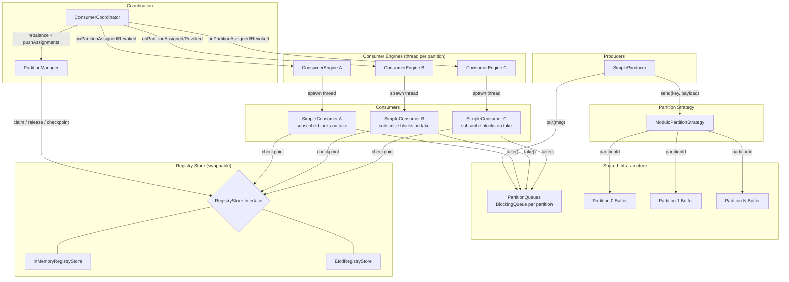
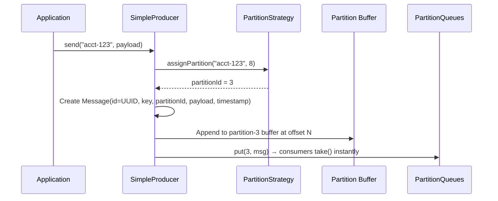
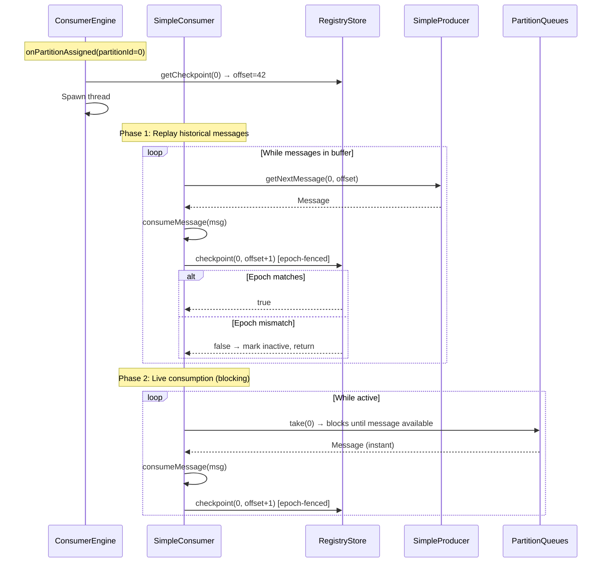
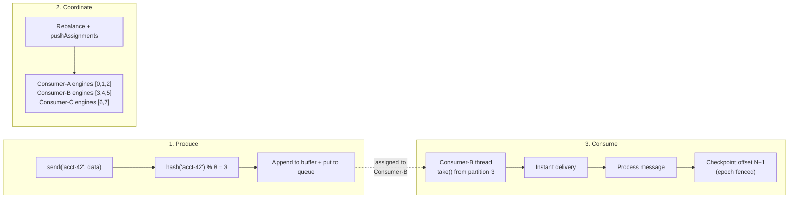
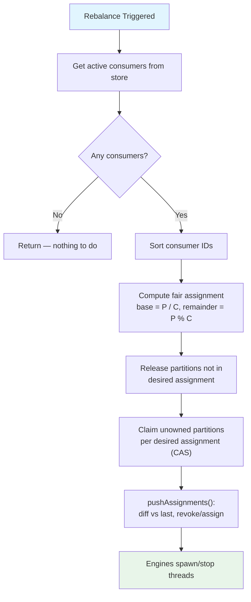
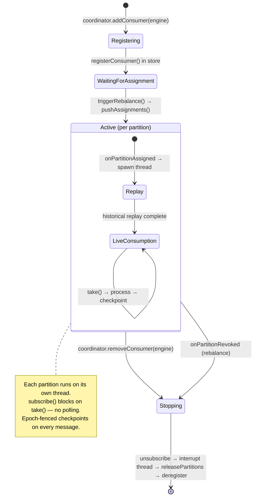
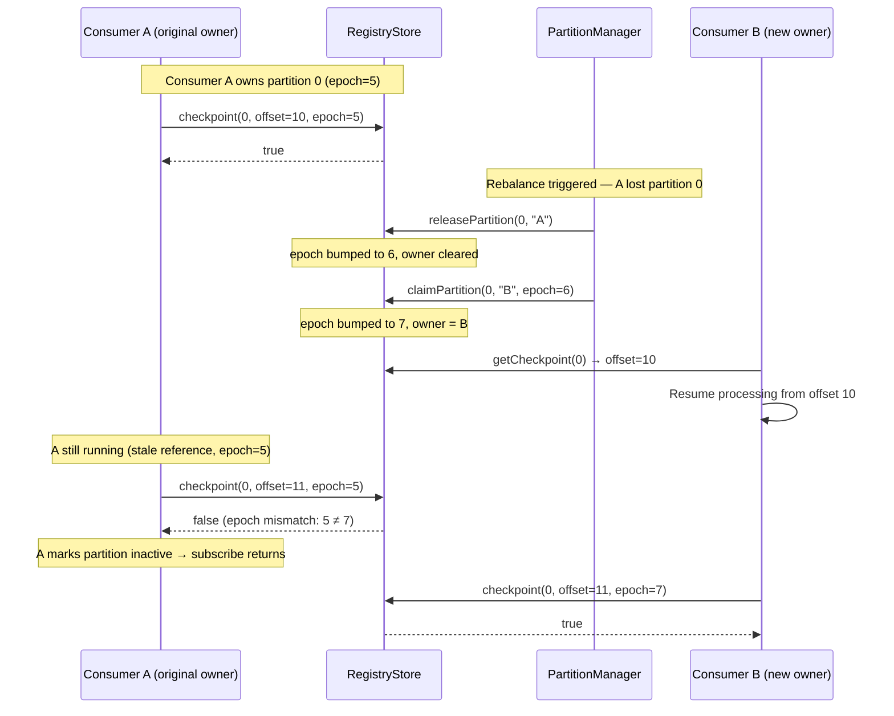
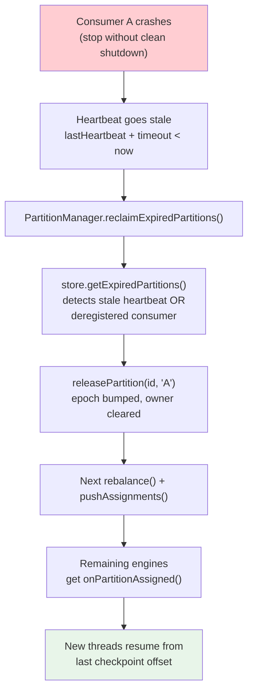
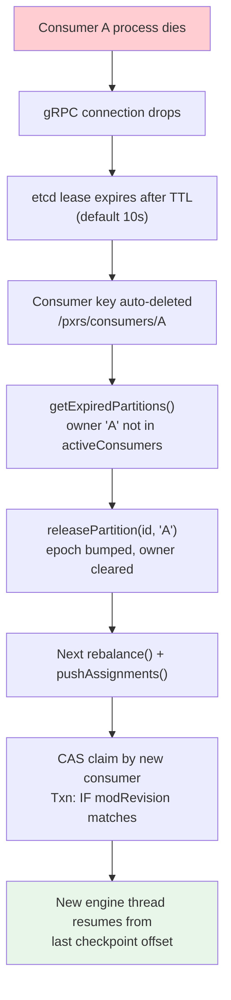

# PXRS - Partitioned Registry Store

A virtual partitioning framework with database-backed checkpointing for safe parallel message consumption. PXRS enables multiple consumers to process messages concurrently, each with independent checkpoints and epoch-fenced ownership, eliminating message loss and supporting dynamic scaling.

## Table of Contents

- [Problem](#problem)
- [Solution](#solution)
- [Architecture](#architecture)
- [Core Concepts](#core-concepts)
- [Data Flow](#data-flow)
- [Partition Assignment & Rebalancing](#partition-assignment--rebalancing)
- [Consumer Lifecycle](#consumer-lifecycle)
- [Epoch Fencing & Checkpoint Safety](#epoch-fencing--checkpoint-safety)
- [Crash Recovery](#crash-recovery)
- [Store Backend Swappability](#store-backend-swappability)
- [Configuration](#configuration)
- [Project Structure](#project-structure)
- [Getting Started](#getting-started)
- [Testing](#testing)

---

## Problem

A point-to-point in-memory/direct-socket model with a single global checkpoint has several critical limitations:

- **No multi-consumer support** — only one consumer can process messages at a time
- **No parallel processing** — throughput is capped by a single consumer's speed
- **Message loss on crash** — a consumer crash loses all in-flight progress since the last global checkpoint
- **No partition isolation** — a slow message blocks all other messages in the system

## Solution

PXRS introduces **virtual partitioning** with **per-partition, per-consumer checkpointing** backed by a coordination store (etcd by default, swappable via the `RegistryStore` interface):

- Messages are deterministically assigned to partitions via a pluggable `PartitionStrategy`
- Each partition has an independent owner, checkpoint offset, and version epoch
- Consumers claim partitions atomically (CAS) and advance checkpoints with epoch fencing
- Dead consumers are detected automatically (lease expiry or heartbeat timeout) and their partitions are reclaimed and redistributed
- **No polling** — consumers block on `BlockingQueue.take()` for instant message delivery
- **Push-based assignments** — the coordinator diffs partition ownership and pushes assign/revoke events to consumer engines

---

## Architecture



---

## Core Concepts

### Partition

A logical bucket to which messages are assigned. Each partition has independent state:

| Field | Description |
|-------|-------------|
| `partitionId` | Integer identifier (0 to N-1) |
| `ownerId` | Consumer currently responsible for this partition |
| `lastCheckpoint` | Offset of the last successfully processed message |
| `versionEpoch` | Monotonically increasing counter, bumped on every claim/release |
| `lastHeartbeat` | Timestamp of last activity (for zombie detection) |

### PartitionQueues

A shared `Map<Integer, BlockingQueue<Message>>` that bridges producers and consumers. The producer pushes to the queue on `send()`, and consumers block on `take()` — eliminating polling entirely.

### ConsumerEngine

Manages the thread-per-partition lifecycle for a single consumer:
- `onPartitionAssigned(partitionId)` — reads checkpoint from store, spawns a daemon thread that calls `consumer.subscribe(partitionId, checkpoint)`
- `onPartitionRevoked(partitionId)` — calls `consumer.unsubscribe()`, interrupts the thread, joins with timeout

### Epoch Fencing

Every partition carries a `versionEpoch`. Claim and release operations increment it. Checkpoint updates require the caller to supply the expected epoch — if it doesn't match, the update is rejected. This prevents a stale (fenced-off) consumer from overwriting a new owner's progress.

### Compare-And-Swap (CAS)

Partition claiming is atomic. In etcd, this uses the Txn API with `modRevision` comparison. In the in-memory store, `synchronized` blocks provide the same guarantee. Exactly one consumer wins when two race to claim the same partition.

---

## Data Flow

### Producer Send Flow



### Consumer Subscribe Flow



### End-to-End Message Flow



---

## Partition Assignment & Rebalancing

### Fair-Share Algorithm

Partitions are distributed evenly across active consumers. With `P` partitions and `C` consumers:

- Each consumer gets `floor(P / C)` partitions
- The first `P mod C` consumers each get one extra partition
- Partition IDs are assigned in sorted consumer order for determinism



### Rebalance Examples


---

## Consumer Lifecycle



---

## Epoch Fencing & Checkpoint Safety

Epoch fencing prevents stale consumers from corrupting checkpoint state after losing partition ownership.



---

## Crash Recovery

### With InMemoryRegistryStore



### With EtcdRegistryStore



---

## Store Backend Swappability

The `RegistryStore` interface is the central abstraction. All coordination — consumer registration, partition claiming, checkpointing, and zombie detection — flows through it. Swapping backends requires zero changes to producers, consumers, or coordination logic.


| Backend | Atomic Claiming | Heartbeat / Zombie Detection | Best For |
|---------|----------------|------------------------------|----------|
| **InMemory** | `synchronized` block | Timestamp comparison | Unit tests, single-JVM dev |
| **etcd** | Txn CAS on `modRevision` | Lease TTL auto-expiry | Distributed production |
| **Oracle/Postgres** | `UPDATE ... WHERE epoch=?` | Polling `last_heartbeat` column | Enterprise environments |
| **Redis** | `WATCH/MULTI/EXEC` or Lua | Key TTL expiry | High-throughput |

---

## Configuration

All tuning knobs are centralized in `PxrsConfig` using the builder pattern:

```java
PxrsConfig config = PxrsConfig.builder()
    .numPartitions(16)              // default: 16
    .leaseTtlSeconds(10)            // default: 10
    .rebalanceIntervalMs(10000)     // default: 10000
    .etcdEndpoints("http://localhost:2379")  // default
    .keyPrefix("/pxrs/")            // default
    .build();
```

| Option | Default | Description |
|--------|---------|-------------|
| `numPartitions` | 16 | Number of virtual partitions to distribute across consumers |
| `leaseTtlSeconds` | 10 | etcd lease TTL; consumer must renew within this window or be considered dead |
| `rebalanceIntervalMs` | 10000 | How often the coordinator checks for rebalancing (ms) |
| `etcdEndpoints` | `http://localhost:2379` | Comma-separated etcd cluster endpoints |
| `keyPrefix` | `/pxrs/` | Namespace in etcd for multi-tenant isolation |

---

## Project Structure

```
pxrs/
├── pom.xml
└── src/
    ├── main/java/com/pxrs/
    │   ├── shared/
    │   │   ├── PxrsConfig.java              # Centralized configuration (builder pattern)
    │   │   ├── Message.java                 # Immutable message record
    │   │   ├── PartitionState.java          # Partition ownership + checkpoint state
    │   │   ├── ConsumerInfo.java            # Consumer registration info
    │   │   ├── PartitionStrategy.java       # Interface: key → partitionId
    │   │   ├── ModuloPartitionStrategy.java # Default: abs(hashCode % N)
    │   │   └── PartitionQueues.java         # BlockingQueue per partition (producer→consumer bridge)
    │   ├── store/
    │   │   ├── RegistryStore.java           # Interface — the swappable coordination layer
    │   │   ├── EtcdRegistryStore.java       # Production: etcd Txn CAS + lease TTL
    │   │   └── InMemoryRegistryStore.java   # Testing: ConcurrentHashMap + synchronized
    │   ├── producer/
    │   │   ├── Producer.java                # Interface: send, getNextMessage, getLatestOffset
    │   │   └── SimpleProducer.java          # In-memory buffer + PartitionQueues push
    │   ├── consumer/
    │   │   ├── Consumer.java                # Interface: subscribe, unsubscribe, checkpoint
    │   │   ├── SimpleConsumer.java          # Blocking subscribe with replay + live take()
    │   │   └── ConsumerEngine.java          # Thread-per-partition lifecycle manager
    │   ├── coordination/
    │   │   ├── PartitionManager.java        # Fair-share assignment + expired reclamation
    │   │   └── ConsumerCoordinator.java     # Push-based rebalance orchestrator with engine management
    │   └── demo/
    │       └── PxrsDemo.java                # Full end-to-end demonstration
    └── test/java/com/pxrs/
        ├── store/
        │   └── InMemoryRegistryStoreTest.java   # 16 tests: CAS races, epoch fencing, expiry
        ├── shared/
        │   └── ModuloPartitionStrategyTest.java # 5 tests: range, determinism, distribution
        └── coordination/
            └── PartitionManagerTest.java        # 12 tests: fair-share, rebalancing, reclaim
```

---

## Getting Started

### Prerequisites

- Java 17+
- Maven 3.8+
- (Optional) etcd for distributed mode

### Build

```bash
mvn clean compile
```

### Run Tests

```bash
mvn test
```

### Run Demo (In-Memory Store)

```bash
mvn exec:java -Dexec.mainClass=com.pxrs.demo.PxrsDemo
```

The demo will:

1. Create 8 partitions, a `PartitionQueues` bridge, and a `SimpleProducer`
2. Create 3 consumers (A, B, C) each wrapped in a `ConsumerEngine`, registered via `coordinator.addConsumer()`
3. Trigger rebalance — assigns partitions fairly: A gets [0,1,2], B gets [3,4,5], C gets [6,7]
4. Engines spawn threads → each calls `consumer.subscribe()` which blocks on `take()`
5. Send 100 messages — consumers receive them instantly via `PartitionQueues`
6. Print per-consumer stats and checkpoint positions
7. Remove Consumer A via `coordinator.removeConsumer()` (simulating crash)
8. Trigger rebalance — B and C pick up A's orphaned partitions, new threads spawned
9. Send 50 more messages and verify resumed processing from checkpoints
10. Print final stats and shut down

### Run Demo with Custom Partition Count

```bash
mvn exec:java -Dexec.mainClass=com.pxrs.demo.PxrsDemo -Dexec.args="16"
```

### Run Demo with etcd

Start a local etcd instance first:

```bash
etcd --listen-client-urls http://localhost:2379 --advertise-client-urls http://localhost:2379
```

Then run:

```bash
mvn exec:java -Dexec.mainClass=com.pxrs.demo.PxrsDemo -Dexec.args="--etcd"
```

---

## Testing

33 tests covering three areas:

### InMemoryRegistryStoreTest (16 tests)

- Initialization: partition slots created with correct defaults
- Consumer registration and deregistration
- **Atomic claiming**: two threads racing on the same partition — exactly one wins
- Claim rejection on wrong epoch or already-owned partition
- Partition release with epoch bump
- **Epoch-fenced checkpointing**: stale epoch or non-owner rejected
- **Zombie detection**: deregistered consumer and stale heartbeat
- Checkpoint preservation across ownership changes

### ModuloPartitionStrategyTest (5 tests)

- Valid range: all results in `[0, numPartitions)`
- Determinism: same key always maps to same partition
- Even distribution across partitions (1000 keys, all partitions used, each > 5%)
- Single partition edge case
- Various partition counts (1 through 100)

### PartitionManagerTest (12 tests)

- Fair-share computation: single consumer, even split, uneven split, more consumers than partitions
- All partitions covered with no duplicates
- **Rebalancing**: initial assignment, after consumer leaves, after consumer joins
- **Expired reclamation**: dead consumer's partitions released and reassigned
- **Checkpoint preservation**: offsets survive rebalance across different owners
