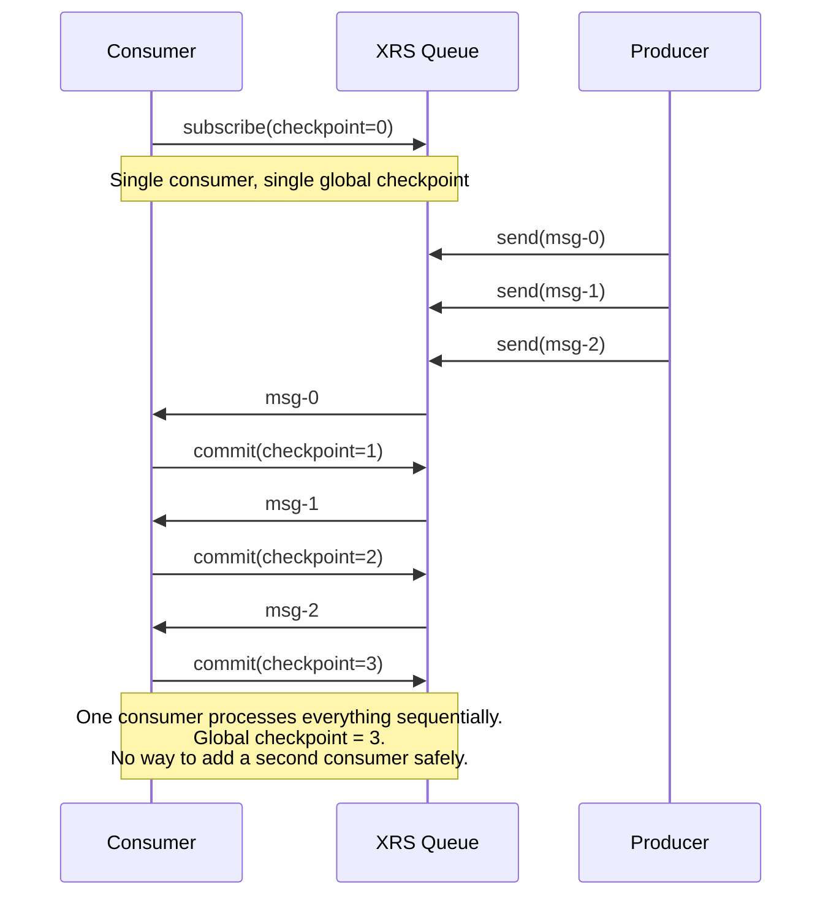
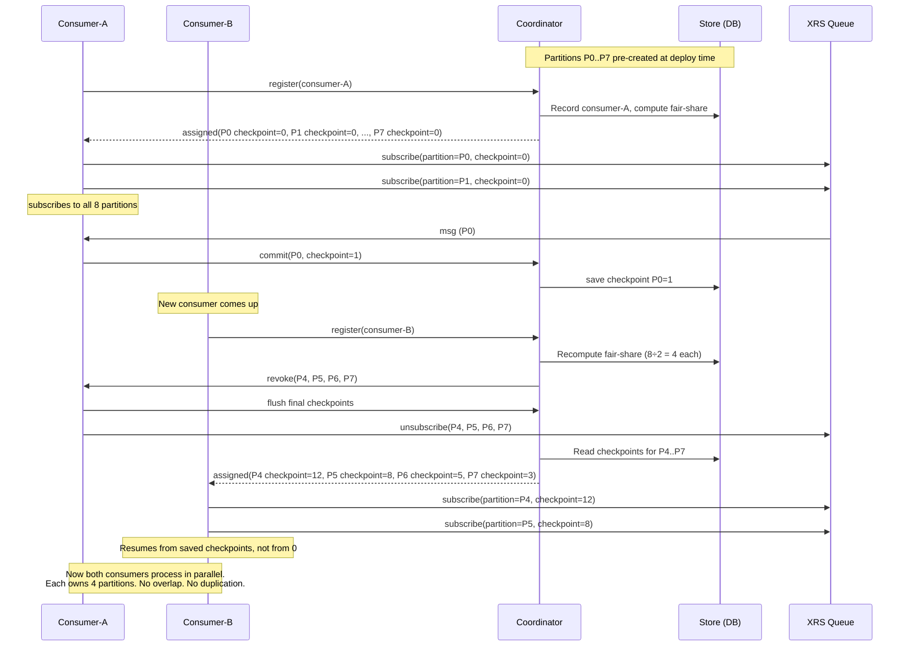
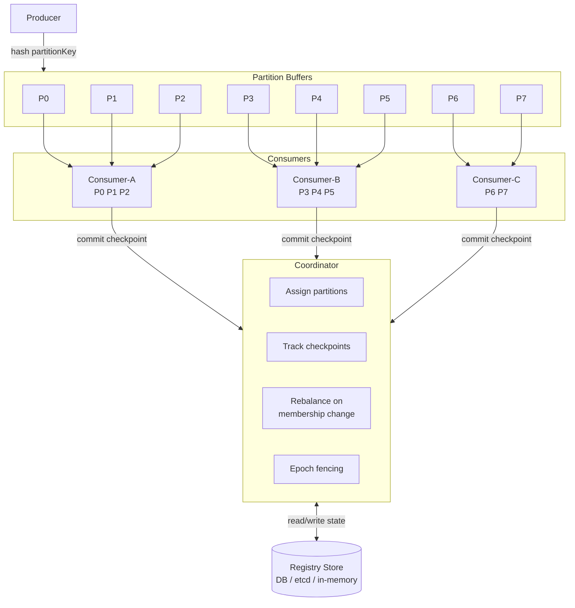
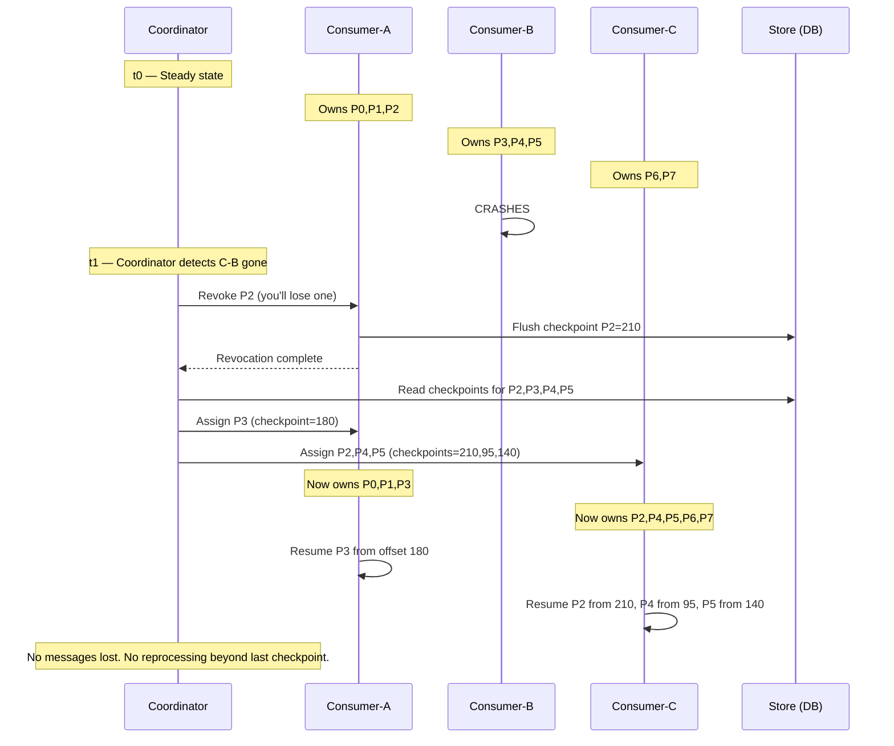

**Subject: Scaling XRS Consumers — Virtual Partitioning Proposal**

---

Hi Team,

I wanted to bring up a scaling limitation we've been running into with XRS queue-based communication and share an approach we've been thinking through. Would love your thoughts on whether this is something the core library could support, or if we should proceed with a POC on our side.

---

### The Problem

Today, XRS follows a **single-consumer, single-global-checkpoint** model. One consumer reads from a queue, processes messages sequentially, and advances a global checkpoint offset.

#### How It Works Today

This works fine at low throughput, but it creates a hard ceiling:

| Constraint | Impact |
|---|---|
| Single consumer per queue | Cannot scale horizontally — adding consumers doesn't help |
| Global checkpoint | If we run two consumers, both read the same messages (duplicate processing) or skip messages (data loss) |
| No ownership model | No way to know which consumer is responsible for which messages |
| Recovery is all-or-nothing | Consumer crash → replay everything from global checkpoint, no partial progress |

As our message volumes grow, **a single consumer simply can't keep up**, and we have no safe way to add more.

---

### What We Need

The core requirement is **safe parallel consumption** — multiple consumers processing different messages simultaneously, without duplication or loss. This breaks down into:

1. **Message partitioning** — deterministically split messages into partitions so related messages stay ordered within a partition
2. **Partition ownership** — each partition assigned to exactly one consumer at a time (no two consumers process the same partition)
3. **Per-partition checkpoints** — each partition tracks its own progress independently
4. **Coordinated rebalancing** — when consumers join, leave, or crash, partitions redistribute fairly and safely
5. **Fencing against stale consumers** — a crashed consumer that comes back late must not overwrite progress made by its replacement

---

### Proposed Approach — Virtual Partitioning with Coordinated Checkpoints

The idea is to introduce a **virtual partitioning layer** between the queue and consumers, managed by a **coordinator** that handles all assignment and checkpoint bookkeeping.

#### Partition Count — Fixed and Pre-decided

Partitions are **not dynamic** — the count is chosen upfront at deployment time and stays fixed. The number should be large enough to accommodate the maximum number of consumers we'll ever run. In our case, we don't expect more than **4–5 consumers**, so a partition count of **8** gives us good headroom:

| Consumers | Partitions per Consumer | Distribution |
|---|---|---|
| 1 | 8 | Single consumer handles all — same as today, but with per-partition checkpoints |
| 2 | 4 each | Even split |
| 3 | 3, 3, 2 | Fair-share (first consumers get one extra) |
| 4 | 2 each | Even split |
| 5 | 2, 2, 2, 1, 1 | Fair-share |

The rule is simple: `base = partitions ÷ consumers`, and the first few consumers get one extra to cover the remainder. Partition count **never changes at runtime** — only the assignment of partitions to consumers changes when consumers join or leave.

Why not just use 1 partition per consumer? Because a fixed higher count gives us room to scale without redeployment. If we start with 2 consumers and later need 4, the coordinator just redistributes the same 8 partitions — no data migration, no config change.

#### How It Would Work With Partitioning

The key difference from today: consumers don't just `subscribe(checkpoint)` against the whole queue. They **register** with a coordinator first, receive specific **partition + checkpoint** pairs, and then `subscribe(partition, checkpoint)` only for their assigned partitions.

#### High-Level Architecture

#### How It Works

| Aspect | How it works |
|---|---|
| **Partitioning** | Producer hashes a message key (e.g., account ID) to one of the 8 fixed partitions. Messages with the same key always land in the same partition — ordering preserved per entity |
| **Assignment** | Coordinator does fair-share math: 8 partitions ÷ 3 consumers = 3, 3, 2. Deterministic, no overlap, recalculated only on membership change |
| **Checkpointing** | Each partition maintains its own checkpoint. Consumer commits progress per-partition through the coordinator. Partition 3 at offset 500 is independent of Partition 7 at offset 12 |
| **Rebalancing** | Only triggered by membership change (join/leave/crash) — not periodic. Two-phase: (1) revoke partitions from consumers losing them — they flush final checkpoints, (2) assign to new owners starting from saved checkpoint |
| **Epoch fencing** | Every partition carries a version epoch that increments on ownership change. Checkpoint writes must match current epoch — a stale consumer's late writes are rejected |
| **Recovery** | Crashed consumer's partitions get reassigned. New owner resumes from per-partition checkpoint — not from zero |

---

### Rebalance Scenario — Consumer Crash & Recovery

---

### Checkpoint Flow

The checkpoint data itself is simple — just a partition ID and an offset number, stored per partition:

| Partition | Owner | Checkpoint (offset) | Epoch |
|---|---|---|---|
| P0 | consumer-A | 340 | 3 |
| P1 | consumer-A | 285 | 2 |
| P2 | consumer-C | 210 | 5 |
| P3 | consumer-A | 182 | 4 |
| P4 | consumer-C | 96 | 4 |
| P5 | consumer-C | 141 | 3 |
| P6 | consumer-C | 73 | 1 |
| P7 | consumer-C | 58 | 1 |

Consumers never write to the store directly — all checkpoints flow through the coordinator, which validates the epoch before persisting. This keeps the coordination logic centralized and consumers simple.

The store backend is swappable — for production, we're looking at a couple of Oracle tables. For local dev and tests, an in-memory implementation works.

---

### What We're Asking

We see two paths forward:

1. **Core library support** — If the XRS team sees this as a broadly useful pattern, it could be built into the library itself (partitioned queues, coordinator APIs, checkpoint storage). This would benefit all consumers of XRS.

2. **Application-level POC** — If the library path isn't feasible near-term, we can build this as a layer on top of XRS on our side. We've already done some design work and have a working prototype with an in-memory store and a DB-backed (Oracle) store for checkpoint persistence.

Either way, we'd love to set up a quick call to walk through the design and get your input — especially around the partitioning semantics and how it would fit with the existing XRS message model.

Happy to share the prototype code if that's helpful.

Thanks,
[Your Name]
